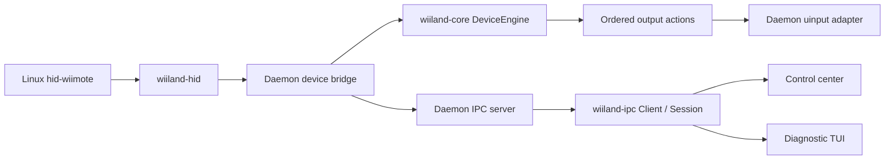

# Architecture

WiiLand keeps hardware ownership in one process. Applications either own
`wiiland-hid` interfaces directly or use `wiiland-ipc` while the daemon owns them.
The GUI and the normal TUI mode use the latter path for live capture.

## Processing and ownership

`wiiland-core::DeviceEngine` accepts semantic input, explicit pointer ticks, and
resets. It has no hardware, filesystem, wall clock, or output device dependency.
It appends ordered actions to a reusable buffer; key actions include their
synchronization boundary and motion actions use explicit synchronization.
Its constructor consumes a `ValidatedConfig`, distinct from mutable GUI drafts.

Logical `Button`, `ButtonState`, and `InputSource` types live in
`wiiland-core::input`; the HID facade reexports the shared button types.
The engine tracks held buttons by source and combines their output ownership.
Releasing one of two bindings to the same virtual key keeps that key pressed
until its final owner releases it. `SourceRemoved` releases one interface's
buttons. A full `Reset` clears all held input and aim activation, whereas a
tracking-only aim reset preserves activation while forgetting sensor baselines.

The daemon bridge owns the HID interface and virtual devices. It adapts HID
reports into engine inputs, executes actions, and recreates outputs when a
profile-required interface disappears. Destruction releases all virtual keys;
reset clears pointer and aim state before processing resumes. Capture-only
interfaces never feed the engine or trigger output recreation on loss.

The reactor owns device slots, reconciliation, and IPC service. `RuntimePlatform`
supplies device creation, discovery, readiness, shutdown, and time;
`DeviceSession` supplies the owned device operations. Deterministic test
implementations exercise the actual reactor without opening HID or uinput.
Production uses `SystemPlatform` and remains single-threaded for device
ingestion and output.

One discovery worker produces coalesced snapshots. A snapshot may contain at
most 128 candidates; overflow rejects the whole snapshot rather than removing
devices using incomplete discovery. The reactor applies at most two device
setup attempts and drains at most 32 monitor records per iteration. Device
draining and IPC acceptance, reads, frames, and writes also have fixed budgets.
These are work-count bounds: a slow individual kernel operation can still delay
a pointer tick. Discovery is applied after the readiness batch, so a slot cannot
be replaced while old readiness entries still refer to it.

Virtual devices have one descriptor cleanup owner on both successful and failed
construction. System signal handling has one process owner; daemon worker
threads inherit blocked termination signals so handler teardown cannot race
those workers. Diagnostic writers and frontend workers run separately from
their respective input/UI loops.

`Button::code`, `Button::from_code`, and
`EventKind::event_type().code()` own the semantic conversion. IPC DTOs remain
independent wire types. Cross-boundary contract tests check their event codes,
button identities, and report shapes.

## Diagnostics

Trace and lifecycle records use separate bounded writer queues: at most 256
records of at most 16 KiB each. Producers use `try_send`; full queues, oversized
records, and disconnected writers drop records rather than blocking ingestion.
Recovery reports dropped records on the corresponding output stream. Shutdown
allows each writer up to 100 ms to finish after device ownership is released;
a permanently blocked output consumer cannot stall shutdown indefinitely.

Protocol diagnostics expose cumulative queue-loss counters, maximum pointer-tick
lateness, and maximum dispatch duration in microseconds. Dispatch time excludes
waiting in `poll` and includes applying discovery and periodic work;
pointer lateness also reflects delays across iterations.
These are operational observations, not hard real-time guarantees.

## IPC 1.1

Protocol major 1 remains compatible with existing status, device, subscription,
and input messages. Minor 1 adds these correlated commands:

| Command | Result | Meaning |
| --- | --- | --- |
| `diagnostics` | `diagnostics` | Reactor timing and diagnostic queue-loss counters |
| `config` | `config` | Canonical text of the running validated configuration |
| `start_capture` with `syspath` | `capture_started` | Device snapshot after opening readable sensors |
| `stop_capture` | `capture_stopped` | Release this connection's sensor leases |

Each connection can lease up to 32 devices. Repeated acquisition is idempotent.
Leases are shared across clients; stopping or disconnecting one client preserves
other clients' leases. Interfaces required by the configured profile remain
open when the last capture lease disappears. Pending interfaces remain visible
in the returned device snapshot and can be retried on hardware availability.
Capture never changes the daemon profile or emits input from diagnostic-only
interfaces. Subscribe separately to receive samples.

The transport queues bounded control requests for the reactor rather than
owning devices or configuration. Socket ownership, permissions, locking, and
race-resistant cleanup live in `wiilandd/src/ipc/socket.rs`. Those rules are
unchanged by the architectural separation.

`Client` negotiates versions with a two-second handshake read/write timeout.
Correlated requests use one absolute read deadline when a read timeout is set;
partial frames and intervening notifications cannot extend it. The configured
timeout is restored afterward. Subsequent blocking operations retain
caller-configurable timeouts. `poll_event` reads at most one socket chunk and
retains partial frames, allowing workers to check cancellation and deadlines
between reads; `next_event` remains the blocking convenience API. New command
methods report that protocol 1.1 is required when connected to an older daemon.

`Session` supplies a bounded background subscription for frontends. It resolves
a selector against the daemon device list and leases that snapshot of devices.
An empty trace selector captures all devices present at startup; an empty
calibration selector chooses the first. Start a new session for newly connected
devices. Strict sessions, used by traces, terminate with an explicit error on
queue overflow. `start_visualization`, used by the TUI, can replace old sensor
values in its 64-event queue when the consumer falls behind. It preserves button
and lifecycle events, exposes a cumulative sample replacement count, and still
fails if control events overflow. Cancellation closes the connection, and
completion is delivered only after queued events.

`CaptureConnection` exposes the same selection and connection-owned leases to
blocking worker consumers. GUI calibration uses it directly: a worker owns the
deadline and sensor accumulation, with no sample queue tied to UI repainting.
Only connection information and a typed calibration result reach the GUI.
Device/interface loss, transport failure, incomplete triples, or an unstable
window reject the result. Cancellation and completion release the leases even
when the UI is not polling. Applying results still requires matching the
captured revision, configuration, target, daemon program, and device selector.

## Configuration

`Config::parse_bytes`, `apply_bytes`, `validate`, and `dump` form the shared pure
parser. `config_io` owns environment discovery and filesystem layer loading.
Existing `Config::load_*` methods remain compatibility entry points into that
adapter. Both the GUI and file loader use the same byte parser, including line
length and UTF-8 rules.

The GUI configuration worker owns file preparation, validation against the
selected daemon executable, and atomic same-directory persistence. It renames
the exact snapshot submitted for validation. The model consumes typed
load/save completions and performs no persistence. A save of an older revision
still writes its captured target and bytes, but leaves newer edits dirty and
does not trigger a restart. Failures preserve their operation stage and cause.
Progress output is bounded; omitted display output is reported, and does not
prevent validation or persistence from finishing. Subprocess cancellation
reaps children asynchronously and releases pipe readers even if another
process retains a pipe, so dropping a task does not block the UI.

Daemon status, device lists, and daemon calibration are typed application
results. Presentation formatting lives in the UI; only the direct subprocess
adapter parses calibration text, using the shared parser before applying any
values.

Saved configuration and running configuration are distinct: editing/saving a
file does not alter the live daemon until restart. The GUI's daemon status action
shows the running snapshot; file reload continues to read saved settings.

## Validation

Engine session tests cover held-button ticks, reset/reconnection, overlapping
bindings and source ownership, combined profiles, IR loss/reacquisition, and
rejection of invalid drafts. IPC tests cover
wire contracts, per-connection capture cleanup, bounded deferred requests,
partial frames across read timeouts, absolute request deadlines, cancellation,
stalled visualization consumers, and completion ordering. Worker tests exercise
configuration persistence and calibration while the UI is not polling, as well
as failure, cancellation, stale completion, and inherited-pipe cleanup.
Fake platform tests exercise reactor lifecycle ordering and scheduling budgets.
A real daemon subprocess test exercises control dispatch and graceful socket
cleanup without uinput. Existing kernel recovery, socket security, mapping,
GUI transaction, and packaging checks remain applicable. Real hardware and
uinput acceptance tests remain separate from these deterministic checks.
