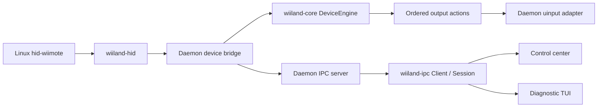

# Architecture

WiiLand keeps hardware ownership in one process. Applications either own
`wiiland-hid` interfaces directly or use `wiiland-ipc` while the daemon owns them.
The GUI and the normal TUI mode use the latter path for live capture.

## Processing and ownership

`wiiland-core::DeviceEngine` accepts semantic input, explicit pointer ticks, and
resets. It has no hardware, filesystem, wall clock, or output device dependency.
It appends ordered actions to a reusable buffer; key actions include their
synchronization boundary and motion actions use explicit synchronization.
Its constructor consumes a `ValidatedConfig`, distinct from mutable GUI drafts.

The daemon bridge owns the HID interface and virtual devices. It adapts HID
reports into engine inputs, executes actions, and recreates outputs when a
profile-required interface disappears. Destruction releases all virtual keys;
reset clears pointer and aim state before processing resumes. Capture-only
interfaces never feed the engine or trigger output recreation on loss.

The reactor owns device slots, signal handling, reconciliation, and IPC service.
It remains single-threaded for device ingestion and output. Device draining and
IPC acceptance, reads, frames, and writes have fixed budgets. Diagnostic writers
and frontend IPC workers run separately from their respective input/UI loops.

`wiiland-hid::Button::code`, `Button::from_code`, and
`EventKind::event_type().code()` own the HID semantic conversion. IPC DTOs remain
independent wire types. Cross-boundary contract tests check their event codes,
button identities, and report shapes.

## Diagnostics

Trace and lifecycle records use separate bounded writer queues: at most 256
records of at most 16 KiB each. Producers use `try_send`; full queues, oversized
records, and disconnected writers drop records rather than blocking ingestion.
Recovery reports dropped records on the corresponding output stream. Shutdown
allows each writer up to 100 ms to finish after device ownership is released;
a permanently blocked output consumer cannot stall shutdown indefinitely.

Protocol diagnostics expose cumulative queue-loss counters, maximum pointer-tick
lateness, and maximum dispatch duration in microseconds. Dispatch time excludes
waiting in `poll`; pointer lateness also reflects delays across iterations.
These are operational observations, not hard real-time guarantees.

## IPC 1.1

Protocol major 1 remains compatible with existing status, device, subscription,
and input messages. Minor 1 adds these correlated commands:

| Command | Result | Meaning |
| --- | --- | --- |
| `diagnostics` | `diagnostics` | Reactor timing and diagnostic queue-loss counters |
| `config` | `config` | Canonical text of the running validated configuration |
| `start_capture` with `syspath` | `capture_started` | Device snapshot after opening readable sensors |
| `stop_capture` | `capture_stopped` | Release this connection's sensor leases |

Each connection can lease up to 32 devices. Repeated acquisition is idempotent.
Leases are shared across clients; stopping or disconnecting one client preserves
other clients' leases. Interfaces required by the configured profile remain
open when the last capture lease disappears. Pending interfaces remain visible
in the returned device snapshot and can be retried on hardware availability.
Capture never changes the daemon profile or emits input from diagnostic-only
interfaces. Subscribe separately to receive samples.

The transport queues bounded control requests for the reactor rather than
owning devices or configuration. Socket ownership, permissions, locking, and
race-resistant cleanup live in `wiilandd/src/ipc/socket.rs`. Those rules are
unchanged by the architectural separation.

`Client` negotiates versions with a two-second handshake read/write timeout;
subsequent blocking operations retain caller-configurable timeouts. New command
methods report that protocol 1.1 is required when connected to an older daemon.

`Session` supplies a bounded background subscription for frontends. It resolves
a selector against the daemon device list and leases that snapshot of devices.
An empty trace selector captures all devices present at startup; an empty
calibration selector chooses the first. Start a new session for newly connected
devices. Queue overflow terminates with an explicit error rather than silently
losing button transitions. Cancellation closes the connection, and completion
is delivered only after queued samples. The GUI rejects incomplete or failed
calibration sessions and retains its existing revision/target ownership checks.

## Configuration

`Config::parse_bytes`, `apply_bytes`, `validate`, and `dump` form the shared pure
parser. `config_io` owns environment discovery and filesystem layer loading.
Existing `Config::load_*` methods remain compatibility entry points into that
adapter. Both the GUI and file loader use the same byte parser, including line
length and UTF-8 rules. The GUI retains atomic same-directory persistence and
validates against the selected daemon executable for offline file operations.

Saved configuration and running configuration are distinct: editing/saving a
file does not alter the live daemon until restart. The GUI's daemon status action
shows the running snapshot; file reload continues to read saved settings.

## Validation

Engine session tests cover held-button ticks, reset/reconnection, combined
profiles, IR loss/reacquisition, and rejection of invalid drafts. IPC tests cover
wire contracts, per-connection capture cleanup, bounded deferred requests,
partial frames across read timeouts, cancellation, and completion ordering.
A real daemon subprocess test exercises control dispatch and graceful socket
cleanup without uinput. Existing kernel recovery, socket security, mapping,
GUI transaction, and packaging checks remain applicable. Real hardware and
uinput acceptance tests remain separate from these deterministic checks.
